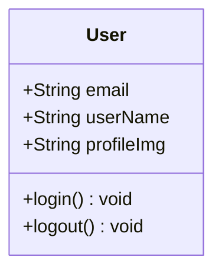
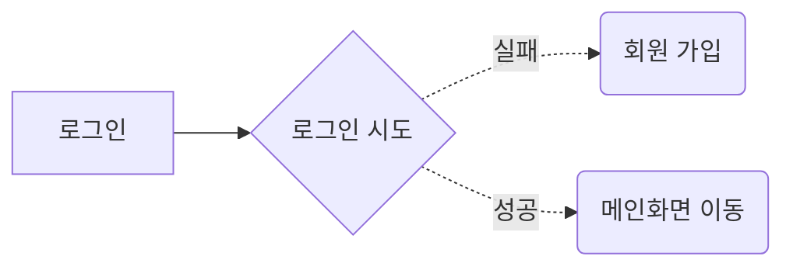
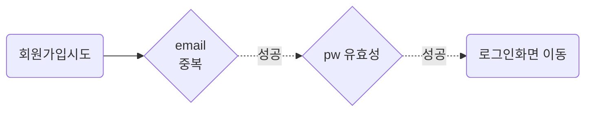
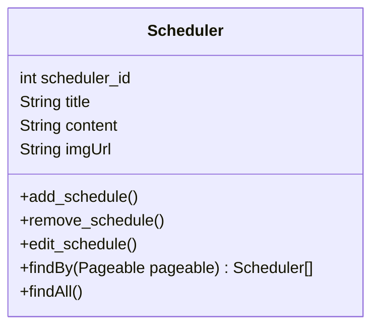

# Use case

## 사용자

### 사용자 요구 기능



### 로그인

- SNS 로그인 생각 있음
- password 암호화 나중에 할거임



### 회원 가입



[//]: # (### 사용자 정보 수정)

[//]: # ()
[//]: # (```mermaid)

[//]: # (flowchart LR)

[//]: # (    MyPage&#40;나의 정보 페이지&#41;)

[//]: # (    MyPage --> Edit1&#40;이름 변경&#41;)

[//]: # (    MyPage --> Edit2&#40;프로필 변경&#41;)

[//]: # (    MyPage --> Edit3&#40;비밀번호 변경&#41;)

[//]: # (```)

## 스케줄

### 스케줄 요구 기능


